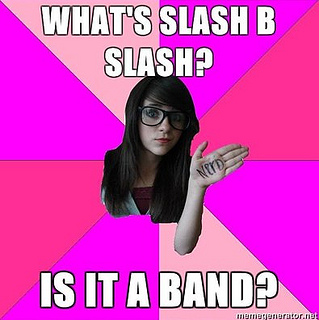

UI Test Frameworks
==================

<br>

João Lucas & Rafael Guedes

<br />

Front In BH - 2014

----

## Quem somos?

#### Não, não somos mais uma dupla sertaneja!

----

## Quem somos?

 - **João Lucas Santana** ( @jlucasps )
  - UI Engineer na Avenue Code
  - Ruby e JavaScript developer
  - Empreendedor por insistência

 - **Rafael Guedes** ( @rafaelmenta )
  - UI Engineer na Avenue Code
  - Desenvolvimento web desde 2007
  - Testando em front-end desde 2013

---

## Cenário

 - Javascript mal estruturado
 - JS e CSS misturados com HTML
 - Péssima rastreabilidade, reusabilidade e manuntenabilidade

<br />

Resumindo:

 **CAOS**

----

## Melhoramos

 - Separação do código
 - Abstração de esturutras JS (e CSS)
 - Frameworks!

----

## Aplicações complexas
## trazem problemas complexos

Como previni-los?

---

# Testes!

> Os testes no código client-side passam a ter a mesma importância em relação ao server-side

<br />

Sim. Isso também significa integrá-los ao processo de build.

----

## Ferramentas de testes


----

## Ferramentas de testes

[](http://jasmine.github.io/)

- Matchers customizados, spies, async, clock

```javascript
describe("Calculator", function() {
  var calc;

  beforeEach(function() {
    calc = Calculator();
  });

  it('should sum two numbers', function() {
    var result = calc.add(2, 3);
    expect(result).toEqual(5);
  });
});
```

----

## Ferrametnas de testes

[](http://qunitjs.com/)

- jQuery project
- Focado em testar Javascript no browser

```javascript
var calc;
module('Awesome module', {
  setup: function() {
    calc = new Calc();
  },

  teardown: function() { }
});

test('sum', function( ) {
  deepEqual(calc.sum(2, 4), 6, 'Description');
  equal(calc.sum(2, 4), '6', 'Description');
} );
```

----

## Ferramentas de testes

[](http://visionmedia.github.io/mocha/)

- Framework flexível e modular para node.js e browser
- Promise test, ```before``` & ```after``` hooks

```javascript
describe("a promise test", function() {
  before(function() { return db.save([mark, loki, jane]); });

  it('should give me correct user count with callback', function(done) {
    db.find({ type: 'User'}).then(function(data, err) {
      data.length.should.equal(3);
      done();
    });
  });

  it('should give me correct user count with promise', function() {
    db.find({ type: 'User' }).should.eventually.have.length(3);
  });
});
```

----

## Ferramentas de testes

[](http://docs.busterjs.org/en/latest/#)

- Framework flexível e modular para node.js e browser
- Integrado com Sinon.JS

```javascript
buster.spec.expose();
describe("My thing", function () {

  it("has the foo and bar", function () {
    expect("foo").toEqual("bar");
  });

  it("states the obvious", function () {
    expect(true).toBe(true);;
  });

});
```

----

## Como escolher meu framework?

 - Estável
 - Comunidade
 - Compatível com tecnologias do projeto
 - Modular

---

## Ferramentas utilitárias

[](http://karma-runner.github.io/)
[](http://phantomjs.org/)
[](http://chaijs.com/)
[](http://www.browserstack.com/)
[](http://testswarm.signalr.net/)
[](http://blanketjs.org/)
[](http://sinonjs.org/)

----

## Spies


----

## Spies

- Funções que informam sobre funções executadas
  - Chamadas
  - Argumentos
  - Contexto
  - Retorno
  - Exceções

----

## Stubs


----

## Stubs

- Spy com comportamento pré-estabelecido
- ~Engana~ o fluxo do sistema
  - Especialmente útil para código com dependências

----

## Mocks


----

## Mocks

- Métodos com comportamento pré-estabelecido
- Fazem seu código falhar se não forem executados corretamente

----

## Fakes



----

## Fakes

- Mais simples do que Mocks
- Interface de objetos reais
  - Ex: Google Maps object

---

## Mãos à massa


----

### Stack utlizada

 - Karma
 - Mocha
 - Chai (should)
 - Sinon.js

----

## Configurando o Karma

```
npm install karma --save-dev
npm install -g karma-cli

# Plugins
npm install
> karma-mocha karma-chai karma-sinon karma-phantomjs-launcher
> --save-dev
```

```
karma init
karma start
```

*karma.conf.js*

```javascript
module.exports = function(config) {
  config.set({
    // ...
    frameworks: ['mocha', 'chai', 'sinon'],
    files: [
      'js/**/*.js',
      'test/**/*.js'
    ],
    // ...
```

----

## Criando o primeiro teste

test/test.js

```javascript
describe("My first test suite", function() {

  it('should fail', function() {
    true.should.be.false;
  });

});
```

----

## Criando os primeiros testes
## (de verdade)

Arquivo ```js/song.js```

```javascript
var Song = function( duration ) {
  this.duration = duration;     // In seconds
  this.isPlaying = false;
};

Song.prototype.play = function() {
  this.isPlaying = true;      // Song is playing
};
```

----

## Criando os primeiros testes

Arquivo ```test/song.js```

```describe```, ```beforeEach``` e ```expect().to.be.true```

```javascript
describe('Song', function() {
  var song;

  beforeEach( function() {
    song = new Song( 154 );
  });

  it('should be a function', function() {
    Song.should.be.a("function");
  });

  it('should be playing after call play()', function() {
    song.play();
    expect(song.isPlaying).to.be.true;
  });
});
```

----

## Comportamento assíncrono

Arquivo ```test/song.js```

```javascript
Song.prototype.play = function() {
  var self = this;
  this.isPlaying = true;                // Song is playing
  this.timer = setTimeout( function() {
    self.nextSong.call( self );         // Play next song
  }, this.duration * 1000 );            // after X seconds
};

Song.prototype.nextSong = function( ) {
  this.isPlaying = false;             // Song isn't playing
  clearTimeout( this.timer );
  this.player.playNext();             // Play next song
};
```

----

## Comportamento assíncrono

Como verificar que ```nextSong()``` será chamada?

```javascript
Song.prototype.play = function() {
  // ...
  this.timer = setTimeout( function() {
    self.nextSong.call( self );       // Async call
  }, this.duration * 1000 );
};

Song.prototype.nextSong = function( ) {
  // ...
  this.player.playNext();             // Dependencies
};
```

----

## Clock e stubs

Sinon.js para alterar o clock e utilizar stubs

```javascript
var song;
beforeEach( function() {
  song = new Song( 120 ); // 2 minutes
} );

it( 'should call nextSong after X seconds', function( ) {
  var clock = sinon.useFakeTimers();
  sinon.stub( Song.prototype, 'nextSong' ); // Song.prototype

  song.play();
  clock.tick( song.duration * 1000 );

  expect( song.nextSong.calledOnce ).to.be.true; // object song
  clock.restore();
} );

```

----

## Spies

Classe ```js/player.js```

```javascript
var Player = function( ) {
  this.currentSongIndex = -1;
};

Player.prototype.play = function( media ) {
  if ( Array.isArray( media ) ) {
    this.playList = media;            // Save playlist
  } else if ( media instanceof Song ) {
    this.singleSong = media;          // Save a single song
  }
  this.playNext();                    // Start playing
};
```

----

## Spies

Método ```playNext()``` da class ```Player```

```javascript
Player.prototype.playNext = function() {
  var currentSong;                    // Song to play
  if ( this.singleSong || this.playList) {
    this.currentSongIndex += 1;
    if ( this.singleSong && this.currentSongIndex === 0 ) {
      currentSong = this.singleSong;  // Play single song
    } else if ( this.playList && this.currentSongIndex < this.playList.lenght ) {
      currentSong = this.playList[this.currentSongIndex]; // From playlist
    }
    if ( currentSong instanceof Song ) {
      currentSong.player = this;
      currentSong.play();           // Song will play
    }
  }
  return currentSong;               // Song playing
};
```

----

# Spies

Como verificar que ```return currentSong;``` está correto?

```javascript
Player.prototype.playNext = function() {
  var currentSong;
  if ( /* single or playlist ? */ ) {

    if ( this.singleSong ) {
      // Save single song

    } else if ( this.playList ) {

      // Save from playlist
    }

    currentSong.play();             // Song will play
  }
  return currentSong;               // Return song playing
};
```


----

## Spies

Testes com spies: ```test/player.js```

```javascript
it( 'should play the only song and exit the player', function() {
  var clock = sinon.useFakeTimers(),
      player = new Player(), song = new Song( 120 ),
      playNextSpy = sinon.spy( player, 'playNext' ),
      playSpy = sinon.spy(song, 'play');

  player.play( song );
  clock.tick( song.duration * 1000 );

  expect( song.play.calledOnce ).to.be.true;
  expect( playNextSpy.calledTwice ).to.be.true;
  expect( playNextSpy.returnValues[0] ).to.deep.equal( song );
  expect( playNextSpy.returnValues[1] ).to.deep.equal( undefined );

  playNextSpy.restore();
  clock.restore();
});

```


