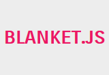

UI Test Frameworks
==================

<br>

 - João Santana
 - Rafael Guedes

<br />

Front In BH - 2014

----

## Quem somos?

 - **João Santana**
  - UI Engineer na Avenue Code
  - Ruby e JavaScript developer
  - Empreendedor por insistência

 - **Rafael Guedes**
  - UI Engineer na Avenue Code
  - Desenvolvimento web desde 2007
  - Testando em front-end desde 2013

---

## Cenário

 - Javascript mal estruturado
 - JS e CSS misturados com HTML
 - Péssima rastreabilidade, reusabilidade e manuntenabilidade

<br />

Resumindo:

 **CAOS**

----

## Melhoramos

 - Separação do código
 - Abstração de esturutras JS (e CSS)
 - Frameworks!

----

## Aplicações complexas
## trazem problemas complexos

Como previni-los?

---

# Testes!

> Os testes no código client-side passam a ter a mesma importância em relação ao server-side

<br />

Sim. Isso também significa integrá-los ao processo de build.

----

## Ferramentas de testes


----


----

## Como escolher meu framework?

 - Estável
 - Comunidade
 - Compatível com tecnologias do projeto
 - Modular

---

## Ferramentas utilitárias





----

## Spies


----

## Spies

- Funções que informam sobre funções executadas
  - Chamadas
  - Argumentos
  - Contexto
  - Retorno
  - Exceções

----

## Stubs


----

## Stubs

- Spy com comportamento pré-estabelecido
- ~Engana~ o fluxo do sistema
  - Especialmente útil para código com dependências

----

## Mocks


----

## Mocks

- Métodos com comportamento pré-estabelecido
- Fazem seu código falhar se não forem executados corretamente

----

## Fakes


----

## Fakes

- Mais simples do que Mocks
- Interface de objetos reais
  - Ex: Google Maps object

---

## Mãos à massa


----

### Stack utlizada

 - Karma
 - Mocha
 - Chai (should)
 - Sinon.js

----

## Configurando o Karma

```
npm install karma --save-dev
npm install -g karma-cli

# Plugins
npm install
> karma-mocha karma-chai karma-sinon karma-phantomjs-launcher
> --save-dev
```

```
karma init
karma start
```

*karma.conf.js*

```javascript
module.exports = function(config) {
  config.set({
    // ...
    frameworks: ['mocha', 'chai', 'sinon'],
    files: [
      'js/**/*.js',
      'test/**/*.js'
    ],
    // ...
```

----

## Criando o primeiro teste

test/test.js

```javascript
describe("My first test suite", function() {

  it('should fail', function() {
    true.should.be.false;
  });

});
```

----

## Criando os primeiros testes
## (de verdade)

Demo calculator.js
